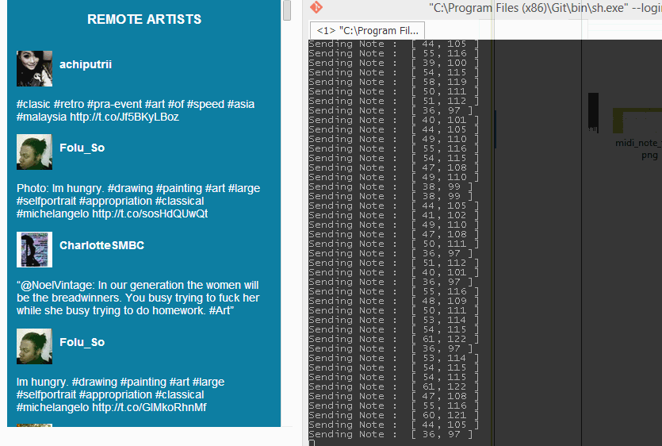

So heres the simple interface to set the Hashtags to track

You can set up to 3 hashtags and also you can use the top search box to make a google search and create notes from the resulst.

When tweets are received, the remote artist section shows up and displays every tweet.

https://github.com/didiercabrera/devart-template/blob/master/project_images/remote_notes.gif